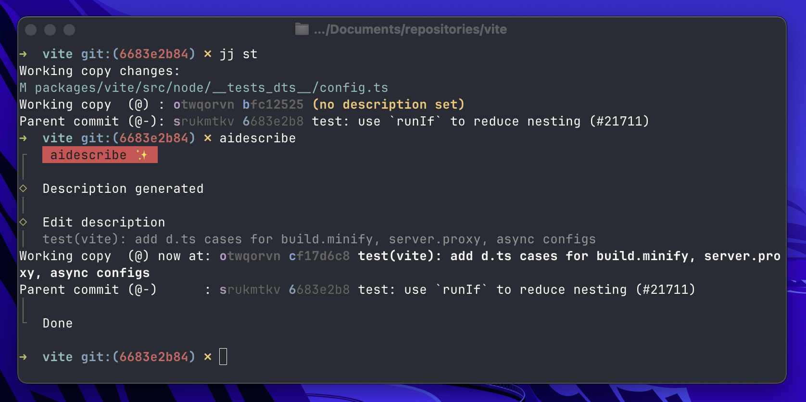

<div align="center">

# aidescribe

**CLI that generates [Jujutsu](https://jj-vcs.github.io/jj/) change descriptions with AI.**



</div>

## Quick Start

```bash
# run without installing
npx aidescribe

# or install globally
pnpm add -g aidescribe
```

Generate a description:

```bash
# supported `jj` target arguments
aidescribe
aidescribe <REVSETS>
aidescribe -r @-
aidescribe -r abc123
aidescribe -rabc123
```

Only inlined `<REVSETS>` and `-r` are forwarded to `jj`.

## Requirements

- Node.js `>=22`
- `jj` installed
- Run inside a Jujutsu repository

## Setup

Run the interactive setup once to connect your AI provider and save config:

```bash
aidescribe connect
```

This saves config to `~/.aidescribe.json`. Currently OpenAI, Anthropic, and Mistral providers are supported.

## Config

View config:

```bash
aidescribe config
aidescribe config get provider
aidescribe config set variantCount=3
```

## Usage

```
aidescribe v0.0.4

Generate jj change descriptions with AI

Usage:
  aidescribe [flags...]
  aidescribe <command>

Commands:
  config         View or modify configuration settings
  connect        Interactive provider setup wizard

Flags:
      --count <number>                 Generate multiple description variants for this run (default: 1)
  -h, --help                           Show help
      --locale <string>                Override locale for this run (default: en)
      --max-diff-chars <number>        Max diff chars sent to AI for this run (default: 40000)
      --max-length <number>            Max generated title length for this run (default: 72, its a soft guidance for the
                                       model, not a local hard cutoff)
      --provider <string>              Override provider for this run (supported: openai, anthropic, mistral)
  -t, --type <string>                  Message format for this run (default: conventional, supports: conventional, plain)
      --verbose                        Print the exact prompt payload sent to the AI model for this run
      --version                        Show version
```
